# Student Result Management System

A modern full-stack web application for managing students, courses, and academic results with real-time updates and comprehensive data validation.

[](https://www.typescriptlang.org/)
[](https://reactjs.org/)
[](https://expressjs.com/)
[](https://www.sqlite.org/)

## ✨ Features

- **📝 Complete CRUD Operations** - Manage students, courses, and results
- **🔄 Real-time Updates** - Optimistic UI with React Query
- **✅ Multi-layer Validation** - Client & server-side with Zod schemas
- **🎯 UPSERT Logic** - Smart handling of duplicate student-course combinations
- **📊 Analytics Dashboard** - Grade distribution and statistics
- **🌐 RESTful API** - Clean, documented endpoints
- **🔍 Advanced Search** - Filter and sort across all data

## 🏗️ Architecture

```mermaid
sequenceDiagram
    participant U as 👤 User
    participant F as 🎨 Frontend
    participant B as ⚙️ Backend
    participant D as 🗄️ Database
    
    U->>F: Fill Student Form
    F->>B: POST /api/students/create
    B->>B: Validate Data
    B->>D: Save Student
    D->>B: Return Success
    B->>F: JSON Response
    F->>U: Show Success Message
```



## 🚀 Quick Start

### Prerequisites

- **Node.js** 18+ and npm
- **Git** for version control

### Installation

1. **Clone the repository**
   ```bash
   git clone https://github.com/yourusername/student-result-management-system.git
   cd student-result-management-system
   ```

2. **Backend Setup**
   ```bash
   cd Backend
   npm install
   npm run dev
   ```
   🚀 Backend runs on `http://localhost:5000`

3. **Frontend Setup** (New terminal)
   ```bash
   cd Frontend
   npm install
   npm run dev
   ```
   🌐 Frontend runs on `http://localhost:5173`

4. **Access the Application**
   - Open `http://localhost:5173` in your browser
   - API health check: `http://localhost:5000/api/health`

## 📁 Project Structure

```
├── Backend/                 # Express.js API server
│   ├── src/
│   │   ├── controllers/     # Request handlers
│   │   ├── services/        # Business logic
│   │   ├── routes/          # API routes
│   │   ├── validation/      # Zod schemas
│   │   └── lib/             # Database & utilities
│   └── tests/               # Integration tests
├── Frontend/                # React SPA
│   ├── src/
│   │   ├── components/      # Reusable UI components
│   │   ├── pages/           # Route components
│   │   ├── api/             # HTTP client
│   │   └── types/           # TypeScript definitions
└── docs/                    # Documentation & diagrams
```

## 🛠️ Technology Stack

### Frontend
- **React 19** + **TypeScript** - Modern UI development
- **Vite** - Fast build tool with HMR
- **React Query** - Server state management
- **React Hook Form** + **Zod** - Form handling & validation
- **Tailwind CSS** - Utility-first styling
- **Axios** - HTTP client

### Backend
- **Express.js** + **TypeScript** - Web framework
- **SQLite** + **better-sqlite3** - Database with WAL mode
- **Zod** - Runtime validation & type safety
- **Vitest** - Testing framework

## 📖 API Documentation

Base URL: `http://localhost:5000/api`

### Core Endpoints
- `GET /health` - Health check
- `GET|POST /students` - Student management
- `GET|POST /courses` - Course management  
- `GET|POST /results` - Result management with UPSERT

### Key Features
- **UPSERT Operations** - Automatic insert/update logic
- **Cascade Deletes** - Referential integrity
- **Validation** - Multi-layer data validation
- **Error Handling** - Structured error responses

📋 [Full API Documentation](./docs/API.md)

## 🎯 Key Highlights

### Smart UPSERT Logic
Results automatically update existing records when adding grades for the same student-course combination, preventing duplicates while maintaining data integrity.

### Multi-layer Validation
- **Frontend**: Real-time validation with React Hook Form + Zod
- **Backend**: Server-side validation with detailed error messages
- **Database**: Constraints and foreign key integrity

### Performance Optimizations
- **Prepared Statements** for secure, fast database operations
- **React Query** for intelligent caching and background updates
- **WAL Mode** SQLite for concurrent read/write operations

## 🧪 Testing

```bash
# Backend tests
cd Backend && npm test

# Frontend tests (when implemented)
cd Frontend && npm test
```

## 📊 Database Schema

- **Students** - Personal information with email uniqueness
- **Courses** - Academic programs with name constraints  
- **Results** - Junction table with grades (A-F) and UPSERT behavior

🗄️ [Detailed Schema Documentation](./docs/DATABASE_SCHEMA.md)

## 📐 Architecture Diagrams

- [Frontend Flow](./docs/diagrams/frontend-flow.svg) - React component lifecycle
- [Backend Flow](./docs/diagrams/backend-flow.svg) - Express request processing
- [Database Flow](./docs/diagrams/database-flow.svg) - SQLite operations

## 🚀 Production Deployment

### Environment Variables
```bash
# Backend
NODE_ENV=production
PORT=5000

# Frontend  
VITE_API_BASE_URL=https://your-api-domain.com/api
```

### Build Commands
```bash
# Backend
npm run build

# Frontend
npm run build
```

## 👥 Authors

**Kunal Panchal** - [Github](https://github.com/kunal070)


