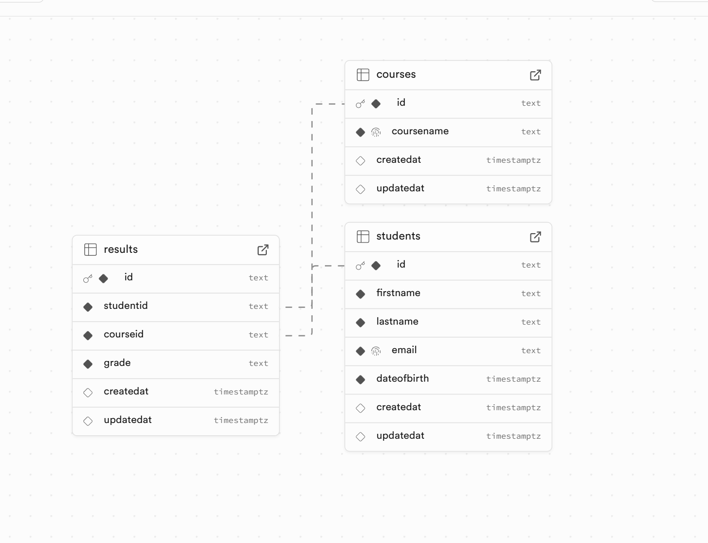

# Database Schema Documentation - Updated

## Student Result Management System

### Overview
This document outlines the database schema for the Student Result Management System, a web application designed to manage student records, course information, and academic results. The system uses SQLite with better-sqlite3 for optimal performance and reliability.

### Database Configuration
- **Database Engine**: SQLite 3
- **Driver**: better-sqlite3 9.6.0
- **Journal Mode**: WAL (Write-Ahead Logging)
- **Foreign Keys**: Enabled
- **Connection Pooling**: Single connection with optimized pragmas

### Entity Relationship Diagram



---

## Table Definitions

### 1. students
The core entity storing student information and personal details.

| Column | Type | Constraints | Description |
|--------|------|-------------|-------------|
| `id` | TEXT | PRIMARY KEY | Unique identifier (UUID v4) |
| `firstName` | TEXT | NOT NULL | Student's first name (1-50 chars) |
| `lastName` | TEXT | NOT NULL | Student's last name (1-50 chars) |
| `email` | TEXT | UNIQUE, NOT NULL | Student's email address (unique, max 100 chars) |
| `dateOfBirth` | DATETIME | NOT NULL | Student's date of birth |
| `createdAt` | DATETIME | DEFAULT CURRENT_TIMESTAMP | Record creation timestamp |
| `updatedAt` | DATETIME | DEFAULT CURRENT_TIMESTAMP | Record last update timestamp |

**Enhanced Business Rules:**
- Email must be unique across all students
- Email format validation enforced at application layer (RFC 5322 compliant)
- Email automatically converted to lowercase and trimmed
- **Disposable email domains blocked**: tempmail.com, throwaway.email, 10minutemail.com, guerrillamail.com, mailinator.com, trashmail.com
- Date of birth must represent a student who is between 10-100 years old
- **Name validation**: Only letters, spaces, hyphens, and apostrophes allowed
- Names automatically trimmed of leading/trailing whitespace
- **Age calculation**: Precise age calculation considering birth date vs current date

**Indexes:**
- `idx_students_email` - Optimizes email lookup and uniqueness checks
- `idx_students_created_at` - Optimizes chronological queries

---

### 2. courses
Stores course information and academic programs.

| Column | Type | Constraints | Description |
|--------|------|-------------|-------------|
| `id` | TEXT | PRIMARY KEY | Unique identifier (UUID v4) |
| `courseName` | TEXT | UNIQUE, NOT NULL | Course name (unique, 3-100 chars) |
| `createdAt` | DATETIME | DEFAULT CURRENT_TIMESTAMP | Record creation timestamp |
| `updatedAt` | DATETIME | DEFAULT CURRENT_TIMESTAMP | Record last update timestamp |

**Enhanced Business Rules:**
- Course names must be unique across the system
- Course names cannot be empty, null, or only whitespace
- **Minimum length**: 3 characters after trimming
- **Maximum length**: 100 characters
- **Allowed characters**: Letters, numbers, spaces, hyphens, ampersands, parentheses, commas, periods
- **Pattern validation**: `/^[a-zA-Z0-9\s\-&(),.]+$/`
- Course names automatically trimmed of leading/trailing whitespace

**Indexes:**
- `idx_courses_name` - Optimizes course name searches and uniqueness checks
- `idx_courses_created_at` - Optimizes chronological queries

---

### 3. results
Junction table storing student grades for specific courses with UPSERT behavior.

| Column | Type | Constraints | Description |
|--------|------|-------------|-------------|
| `id` | TEXT | PRIMARY KEY | Unique identifier (UUID v4) |
| `studentId` | TEXT | NOT NULL, FOREIGN KEY | References students.id |
| `courseId` | TEXT | NOT NULL, FOREIGN KEY | References courses.id |
| `grade` | TEXT | CHECK constraint, NOT NULL | Grade value (A, B, C, D, E, F) |
| `createdAt` | DATETIME | DEFAULT CURRENT_TIMESTAMP | Record creation timestamp |
| `updatedAt` | DATETIME | DEFAULT CURRENT_TIMESTAMP | Record last update timestamp |

**Constraints:**
- `FOREIGN KEY (studentId) REFERENCES students(id) ON DELETE CASCADE`
- `FOREIGN KEY (courseId) REFERENCES courses(id) ON DELETE CASCADE`
- `UNIQUE(studentId, courseId)` - Prevents duplicate results for same student-course combination
- `CHECK(grade IN ('A', 'B', 'C', 'D', 'E', 'F'))` - Ensures valid grade values

**Enhanced Business Rules:**
- Each student can have only one result per course (enforced by UNIQUE constraint)
- Grades are limited to standard letter grades (A, B, C, D, E, F) - **case sensitive**
- **UPSERT behavior**: Creating a result for existing student-course combination updates the existing record
- Cascading deletes ensure referential integrity
- **UUID format validation**: Both studentId and courseId must be valid UUID v4 format
- **Foreign key validation**: Both student and course must exist in their respective tables

**Special Behaviors:**
- **Automatic Updates**: When creating a result for an existing student-course combination, the system updates the existing record instead of creating a duplicate
- **Response Differentiation**: Returns status 201 for new records, 200 for updates
- **Timestamp Management**: `createdAt` preserved on updates, `updatedAt` modified

**Indexes:**
- `idx_results_student_id` - Optimizes student-specific result queries
- `idx_results_course_id` - Optimizes course-specific result queries
- `idx_results_created_at` - Optimizes chronological queries

---

## Relationships

### One-to-Many Relationships

**students → results**
- One student can have multiple results (one per course)
- Relationship: `students.id ← results.studentId`
- Cascade: DELETE CASCADE (removing a student removes all their results)

**courses → results**
- One course can have multiple results (one per student)
- Relationship: `courses.id ← results.courseId`
- Cascade: DELETE CASCADE (removing a course removes all related results)

### Unique Constraints

**Student-Course Combination**
- `UNIQUE(studentId, courseId)` in results table
- Prevents duplicate grades for the same student in the same course
- Enables UPSERT behavior for result management
- Ensures data integrity and business rule enforcement

---

## Database Performance Optimizations

### Indexing Strategy
- **Primary Keys**: Automatic indexing via UUID primary keys
- **Foreign Keys**: Dedicated indexes for join operations and cascade performance
- **Unique Constraints**: Automatic indexing for uniqueness enforcement
- **Timestamp Columns**: Indexed for chronological queries and reporting
- **Composite Index Consideration**: The UNIQUE constraint on (studentId, courseId) acts as a composite index

### SQLite Pragmas (Enhanced Configuration)
```sql
PRAGMA journal_mode = WAL;        -- Write-Ahead Logging for concurrency
PRAGMA foreign_keys = ON;         -- Enforce referential integrity
PRAGMA synchronous = NORMAL;      -- Balanced durability vs performance
PRAGMA cache_size = 1000;         -- Increased cache for better performance (1000 pages)
PRAGMA temp_store = memory;       -- Store temporary data in memory
PRAGMA mmap_size = 268435456;     -- Memory-mapped I/O for large datasets (256MB)
```

### Query Optimization Features
- **Prepared Statements**: All database operations use prepared statements for performance and security
- **Single Connection**: Optimized single connection with proper lifecycle management
- **WAL Mode Benefits**: Concurrent reads while writing, reduced lock contention
- **Memory Mapping**: Large mmap_size for improved I/O performance on large datasets

---

## Enhanced Data Validation Rules

### Application-Level Validations

**Student Validation:**
- **Email Format**: RFC 5322 compliant email validation with automatic lowercase conversion
- **Disposable Email Blocking**: Prevents registration with known disposable email providers
- **Age Verification**: Precise age calculation ensuring students are between 10-100 years old
- **Name Validation**: Pattern matching for letters, spaces, hyphens, apostrophes only
- **Length Limits**: First/last names limited to 50 characters each

**Course Validation:**
- **Length Requirements**: 3-100 characters after trimming whitespace
- **Character Restrictions**: Alphanumeric plus basic punctuation only
- **Whitespace Handling**: Automatic trimming with rejection of whitespace-only names
- **Pattern Validation**: Regex pattern `/^[a-zA-Z0-9\s\-&(),.]+$/`

**Result Validation:**
- **UUID Format**: Strict UUID v4 format validation for foreign keys
- **Grade Enumeration**: Exact case-sensitive matching for grades A-F
- **Foreign Key Existence**: Validation that referenced student and course exist
- **Upsert Logic**: Automatic detection and handling of duplicate student-course combinations

### Database-Level Constraints
- **NOT NULL**: Enforced for all required fields
- **UNIQUE**: Email addresses and course names must be unique
- **CHECK**: Grade values are constrained to valid options (A, B, C, D, E, F)
- **FOREIGN KEY**: Referential integrity maintained with cascade deletes
- **UNIQUE COMPOSITE**: (studentId, courseId) prevents duplicate results

---

## Migration Strategy

### Initial Setup
The database is automatically initialized on first run with all necessary tables, indexes, and constraints using the `initializeDatabase()` function.

### Schema Evolution
- **Version Control**: Schema changes tracked through migration scripts
- **Backward Compatibility**: Careful consideration for existing data during updates
- **Data Migration**: Automated scripts for structural changes
- **Rollback Strategy**: Ability to revert schema changes if needed

### Environment-Specific Databases
- **Development**: `students.db` with verbose logging
- **Testing**: `students-test.db` with isolated test data
- **Production**: Optimized configuration with error-only logging

---

## Security Considerations

### Data Protection
- **UUID Primary Keys**: Prevent enumeration attacks and provide better security than sequential IDs
- **Email Uniqueness**: Prevents account duplication and identity conflicts
- **Parameterized Queries**: All database operations use prepared statements preventing SQL injection
- **Input Validation**: Multi-layer validation (client + server + database)
- **Data Sanitization**: Automatic trimming and normalization of input data

### Access Control
- **Application-level Authorization**: No direct database access from client-side
- **Prepared Statements**: All database operations use parameterized queries
- **Connection Management**: Single controlled database connection
- **Error Sanitization**: Database errors sanitized before returning to client

### Privacy Considerations
- **Data Minimization**: Only necessary student information collected
- **Secure Deletion**: Cascade deletes ensure complete data removal
- **Audit Trail**: Timestamp tracking for all record modifications

---

## Backup and Recovery

### Recommended Backup Strategy
- **SQLite Database Files**: Regular file-based backups of .db files
- **WAL Mode Benefits**: Automatic checkpointing for consistency
- **Transaction Integrity**: ACID compliance ensures data consistency
- **Point-in-Time Recovery**: WAL files enable recovery to specific points

### Recovery Procedures
- **Database Integrity**: Regular integrity checks using `PRAGMA integrity_check`
- **Automated Health Checks**: `checkDatabaseHealth()` function for monitoring
- **Connection Recovery**: Automatic reconnection handling for connection issues
- **Data Validation**: Post-recovery validation of data integrity

### Disaster Recovery
- **File-Level Backup**: Simple file copying for SQLite databases
- **Cross-Platform Compatibility**: SQLite databases are portable across platforms
- **Version Compatibility**: Database format stability across SQLite versions

---

## Performance Monitoring

### Key Metrics
- **Query Execution Time**: Monitoring of prepared statement performance
- **Index Utilization**: Analysis of index usage patterns
- **Database File Size**: Growth tracking and storage optimization
- **Connection Performance**: Single connection efficiency monitoring
- **Cache Hit Ratio**: SQLite page cache performance

### Optimization Opportunities
- **Query Plan Analysis**: Using `EXPLAIN QUERY PLAN` for optimization
- **Index Usage Monitoring**: Identifying unused or needed indexes
- **Cache Performance**: Optimizing page cache size based on usage patterns
- **Connection Pooling**: Consideration for high-concurrency scenarios

### Monitoring Tools
- **Health Check Endpoint**: `/api/health` for service monitoring
- **Database Health Function**: `checkDatabaseHealth()` for internal monitoring
- **Error Tracking**: Comprehensive logging of database errors
- **Performance Logging**: Query execution time tracking

---

## Testing Strategy

### Database Testing
- **Test Isolation**: Separate test database (`students-test.db`)
- **Data Cleanup**: Automatic table clearing between tests
- **Transaction Testing**: Validation of ACID properties
- **Constraint Testing**: Verification of all database constraints

### Integration Testing
- **Foreign Key Constraints**: Testing cascade delete behavior
- **Unique Constraints**: Validation of uniqueness enforcement
- **UPSERT Behavior**: Testing result creation and update logic
- **Data Integrity**: End-to-end data consistency validation

---

*Last Updated: July 2025*  
*Schema Version: 1.0*  
*Database Engine: SQLite 3 with better-sqlite3 9.6.0*